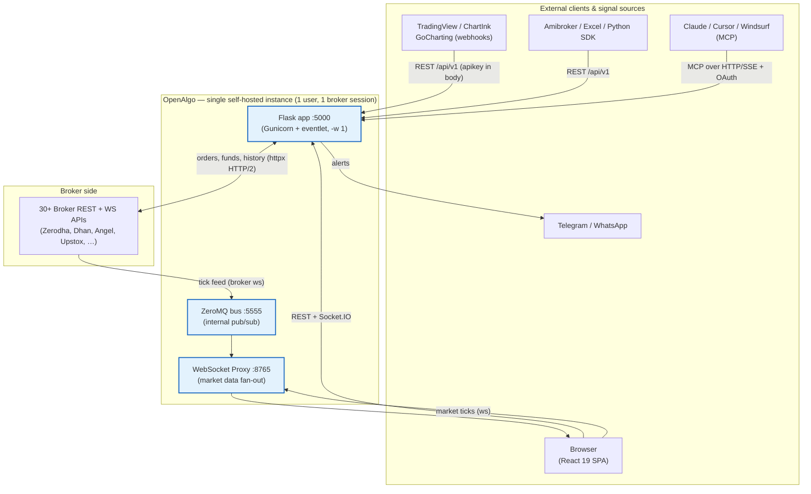
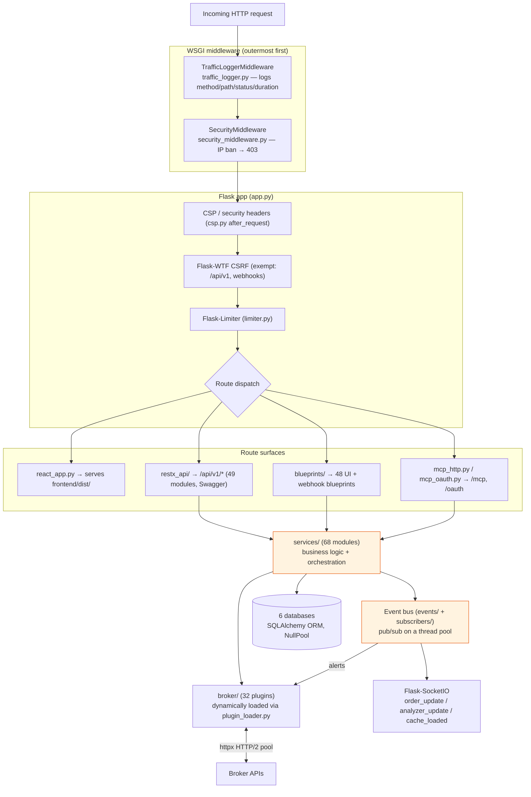
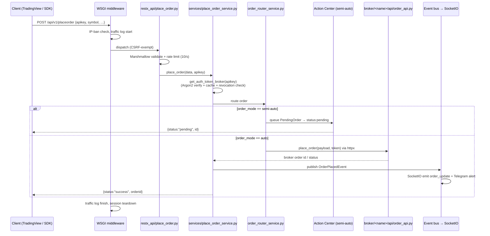
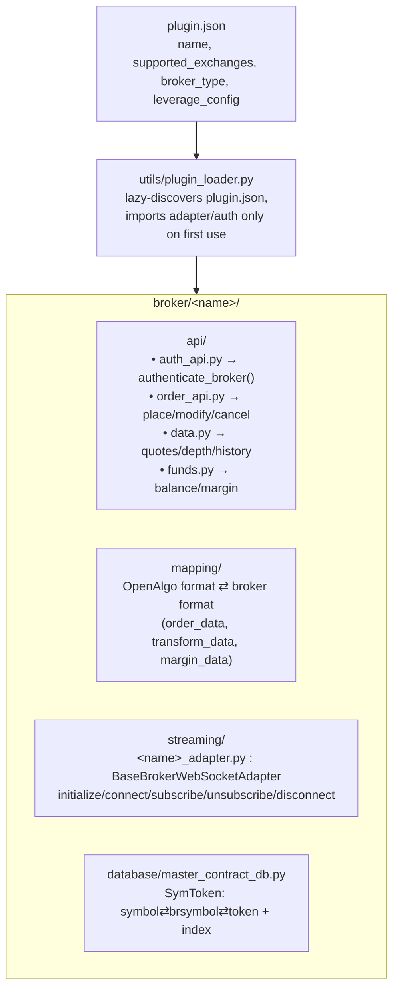
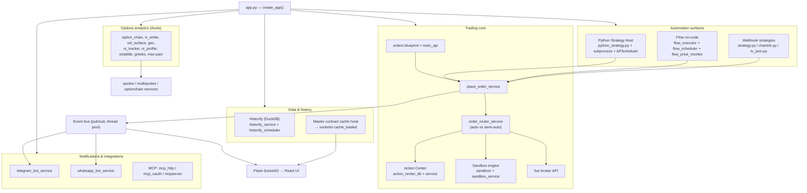
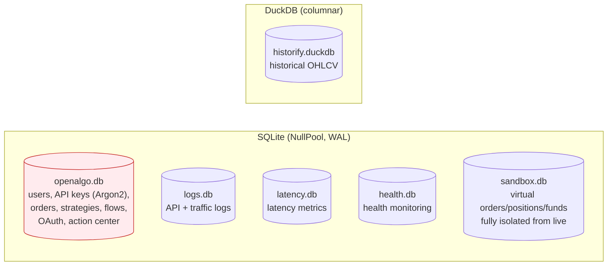
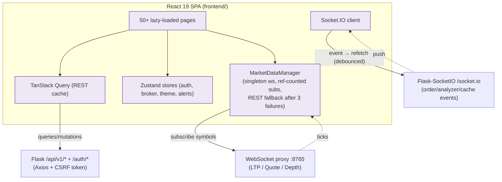
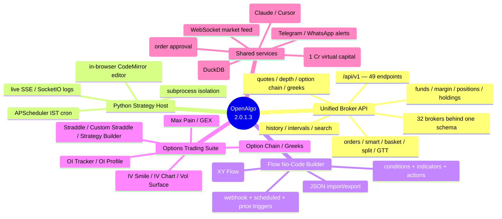

# OpenAlgo — Architecture Diagrams

All diagrams are [Mermaid](https://mermaid.js.org) and render in GitHub, VS Code (with a Mermaid extension), and most Markdown viewers. ASCII fallbacks are included for the two hottest paths.

---

## 1. System Context — who talks to OpenAlgo



**Key fact:** orders/account go through Flask → broker REST; market data is a *separate* pipeline (broker WS → ZeroMQ → proxy → browser) so a slow chart client can never block order placement.

---

## 2. Backend Component Architecture



> Middleware registration is in `app.py:319-323` — security registered first so traffic logging wraps *outside* it. Session cleanup runs in `teardown_appcontext` after the response is sent (removes ~18 scoped sessions to prevent FD leaks).

---

## 3. Request Processing Pipeline (order placement, end-to-end)



If **Analyze/Sandbox mode** is on, the same path is intercepted by `sandbox_service.py` and routed to the virtual exchange instead of the live broker.

---

## 4. Market-Data WebSocket — the 3-layer feed

```mermaid
graph LR
    subgraph L3["Layer 3 — broker native"]
        BWS["Broker WebSocket<br/>(Zerodha/Angel/Dhan …)"]
    end
    subgraph L2["Layer 2 — adapters + ZeroMQ bus"]
        ADP["broker/*/streaming/<name>_adapter.py<br/>normalizes ticks → OpenAlgo format"]
        POOL["ConnectionPool<br/>auto-shards symbols across N adapters"]
        PUB["ZeroMQ PUB :5555<br/>topic = EXCHANGE_SYMBOL_MODE"]
    end
    subgraph L1["Layer 1 — unified proxy"]
        SUB["ZeroMQ SUB"]
        IDX["subscription_index<br/>(symbol,exch,mode) → {client_ids}  O(1)"]
        THR["per-symbol throttle (~50ms)"]
        PROXY["websocket_proxy/server.py :8765"]
    end
    BROWSER["Browser clients<br/>(LTP / Quote / Depth)"]

    BWS --> ADP --> POOL --> PUB --> SUB --> IDX --> THR --> PROXY --> BROWSER
    BROWSER -.->|"auth + subscribe/unsubscribe"| PROXY

    classDef l fill:#e8f5e9,stroke:#2e7d32;
    class ADP,POOL,PUB,SUB,IDX,THR,PROXY l;
```



**Capacity:** `MAX_SYMBOLS_PER_WEBSOCKET` (1000) × `MAX_WEBSOCKET_CONNECTIONS` (3) = **3000 symbols** per broker session, auto-sharded. Modes: `1=LTP`, `2=Quote`, `3=Depth`.

ASCII view of the hot path (tick delivery):

```
broker tick ──► adapter.publish_market_data(topic,data)
                topic = "NSE_RELIANCE_2"
                        │ ZeroMQ multipart [topic][json]
                        ▼
   proxy.zmq_listener():  parse topic → (sym,exch,mode)
                          throttle? (skip if <50ms since last)
                          subscription_index[(sym,exch,mode)] → {client_7, client_12}
                          for each live client: ws.send(data)
```

---

## 5. Broker Plugin Contract (every one of 32 brokers implements this)



**Why this matters:** add a broker by creating one directory that fills this contract + adding it to `VALID_BROKERS`. **Cost:** the contract is copy-implemented per broker, so the 32 adapters total ~29K LOC of near-duplicate code (see improvement #2).

---

## 6. Feature / Subsystem Map — what orchestrates what



---

## 7. Database Map (6 isolated stores)



> Every SQLite engine is created via `database.engine_factory.create_db_engine()` with **NullPool** (fresh connection per op, closed immediately). `StaticPool` is explicitly banned — it corrupts cursor state under concurrency.

---

## 8. Frontend ⇄ Backend Communication (3 channels)



Served in production by `blueprints/react_app.py` from the CI-built `frontend/dist/` (Brotli/gzip pre-compressed; `index.html` no-cache, hashed assets cached 1 year).

---

## 9. The four product surfaces at a glance


